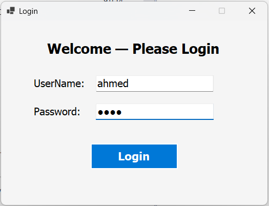
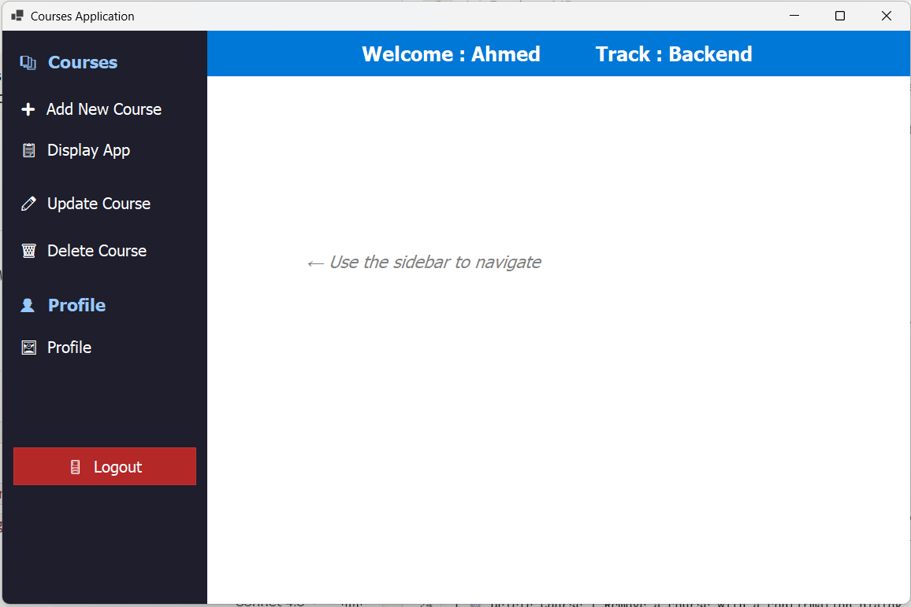
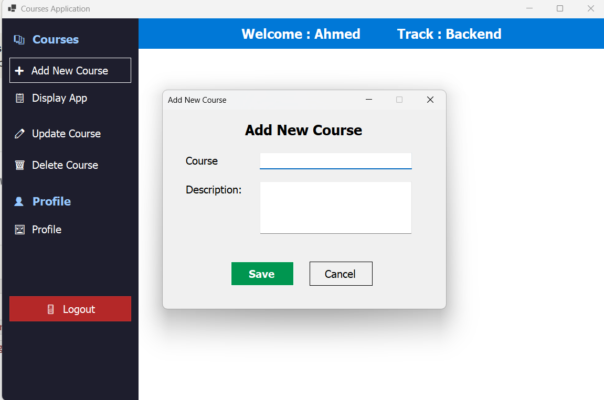
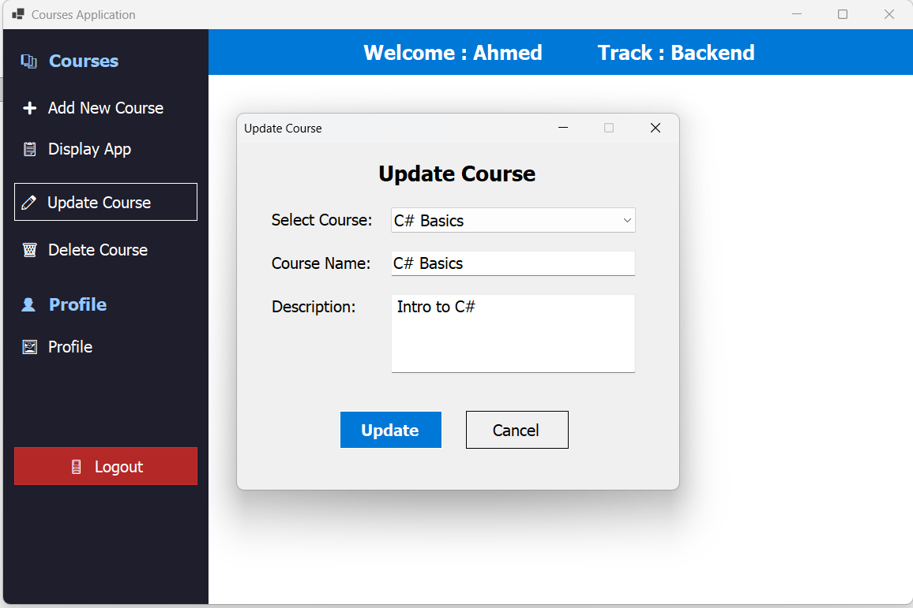
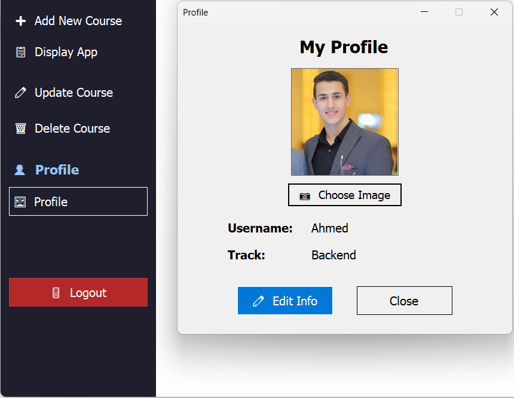

# 📚 D9 Lab — Courses Management System

> A **C# Windows Forms** desktop application built as part of the **ITI Training Program — Day 9 Lab**.  
> The app provides a full courses management system with user authentication, CRUD operations, and profile management.

---

## 🖼️ Screenshots

### 🔐 Login


### 🏠 Dashboard


### ➕ Add Course


### ✏️ Update Course


### 👤 Profile


---

## 🚀 Features

| Feature | Description |
|---|---|
| 🔐 Login System | Authenticate users with username & password via SQL LocalDB |
| 📋 Courses Dashboard | View all courses filtered by the logged-in user's track |
| ➕ Add Course | Add new courses linked to the user's track |
| ✏️ Update Course | Edit existing course name and description |
| 🗑️ Delete Course | Remove a course with a confirmation dialog |
| 👤 Profile Management | View & edit personal info and upload a profile image |
| 🚪 Logout | Secure session logout with confirmation |

---

## 🛠️ Tech Stack

| Technology | Usage |
|---|---|
| **C# .NET 8** | Core language |
| **Windows Forms** | UI Framework |
| **Entity Framework Core 9** | ORM & Data Access |
| **SQL Server LocalDB** | Embedded local database |
| **EF Core Migrations** | Database schema versioning & seeding |

---

## 🗂️ Project Structure

```
D9_Lab/
│
├── 📁 DataLayer/
│   ├── 📁 Models/
│   │   └── User.cs                   # User entity model
│   ├── AppDbContext.cs               # EF DbContext + Seed Data
│   ├── UserData.cs                   # Login & profile update logic
│   └── CourseData.cs                 # Course CRUD (in-memory)
│
├── 📁 Database/
│   └── D9_LabDB.mdf                  # LocalDB database file
│
├── 📁 Migrations/                    # EF Core auto-generated migrations
│
├── 📁 screenshots/
│   ├── login.png
│   ├── dashboard.png
│   ├── addCourse.png
│   ├── updatecourse.png
│   └── Profile.png
│
├── LoginForm.cs/.Designer.cs         # Authentication screen
├── CoursesForm.cs/.Designer.cs       # Main dashboard with sidebar
├── CourseAddForm.cs/.Designer.cs     # Add new course form
├── CourseUpdateForm.cs/.Designer.cs  # Update existing course form
├── CourseDeleteForm.cs/.Designer.cs  # Delete course form
├── ProfileForm.cs/.Designer.cs       # View profile + profile image
├── ProfileEditForm.cs/.Designer.cs   # Edit personal information
└── Program.cs                        # App entry point
```

---

## ⚙️ Getting Started

### Prerequisites
- [Visual Studio 2022](https://visualstudio.microsoft.com/) with **.NET Desktop Development** workload
- SQL Server LocalDB (included with Visual Studio)

### Installation

**1. Clone the repository**
```bash
git clone https://github.com/AhmedDabish/Courses-Management-System.git
cd Courses-Management-System
```

**2. Open the solution in Visual Studio**
```
File → Open → D9_Lab.sln
```

**3. Install NuGet Packages** (if not restored automatically)
```powershell
Install-Package Microsoft.EntityFrameworkCore
Install-Package Microsoft.EntityFrameworkCore.SqlServer
Install-Package Microsoft.EntityFrameworkCore.Tools
```

**4. Apply Migrations to create the Database**
```powershell
Add-Migration InitialCreate
Update-Database
```

**5. Run the project**
```
Press F5  or  Debug → Start Debugging
```

---

## 🔑 Default Test Accounts

| Username | Password | Track |
|----------|----------|-----------|
| Ahmed | 1234 | Backend |
| Sara | 5678 | Frontend |
| Mohamed | abcd | FullStack |

> These accounts are seeded automatically when you run `Update-Database`.

---

## 🗄️ Database

The project uses **SQL Server LocalDB** with an `.mdf` file stored inside the project folder at:
```
D9_Lab/Database/D9_LabDB.mdf
```
The connection is configured in `AppDbContext.cs` and automatically resolves the path relative to the project directory — no manual setup required.

---

## 📌 Notes

- Course data is currently managed **in-memory** via `CourseData.cs`
- User authentication uses **EF Core** connected to LocalDB
- The app uses `AutoScaleMode.None` for consistent UI sizing across different screen DPI settings

---

## 📄 License

This project is for **educational purposes** as part of the ITI C# training program.

---

<p align="center">Made with ❤️ during ITI Training — C# Track</p>
